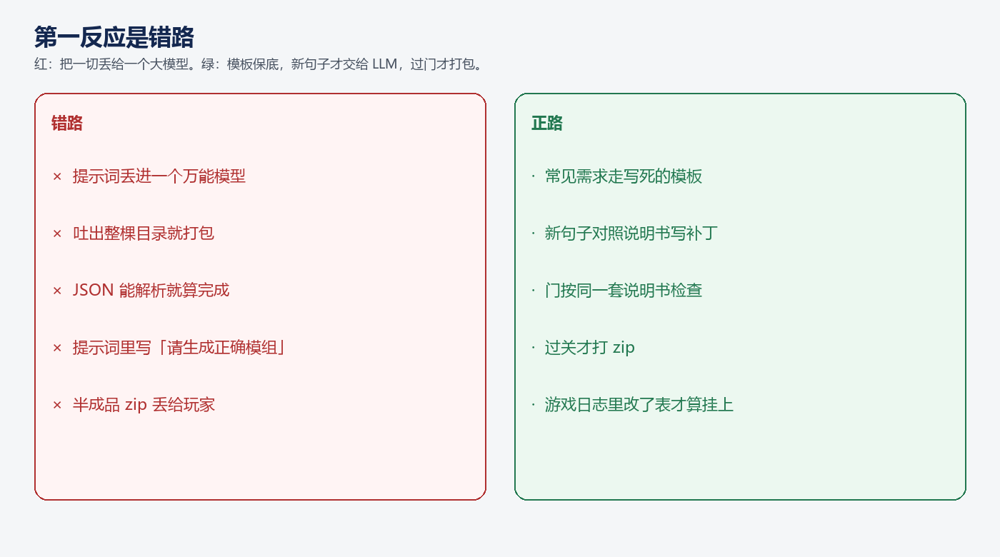
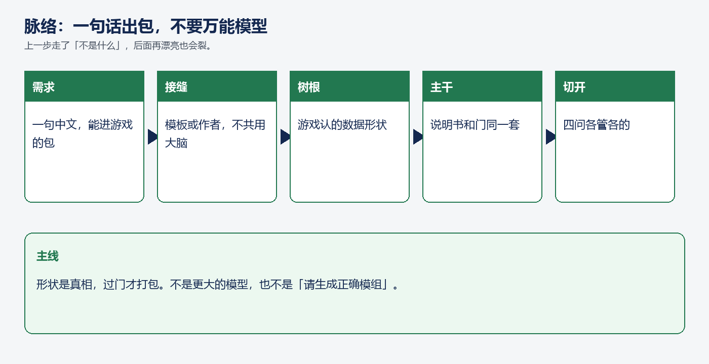
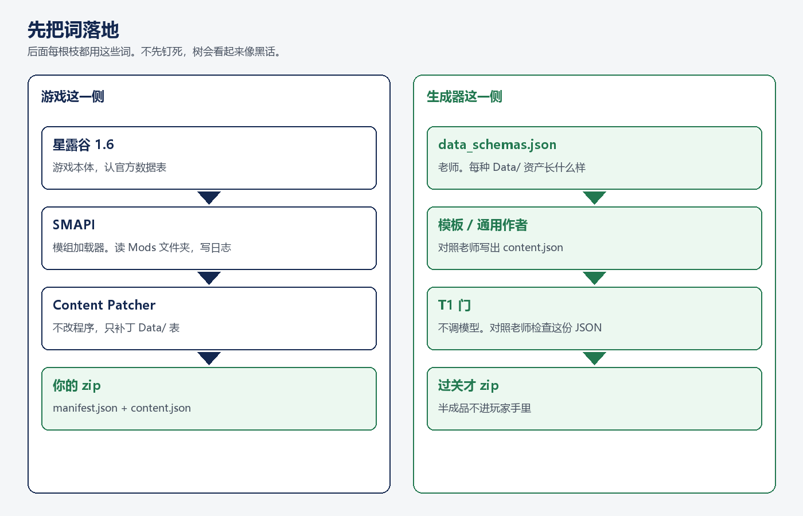
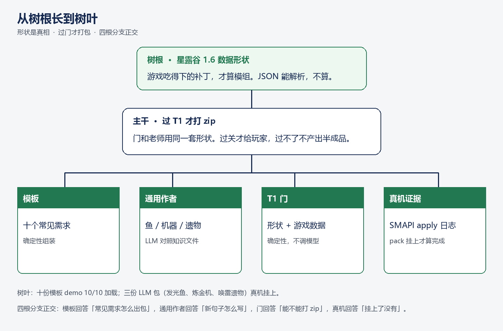
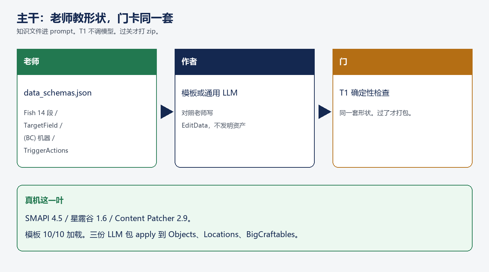
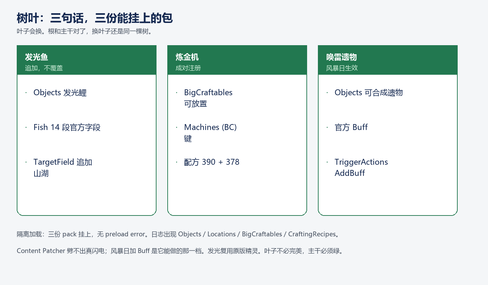
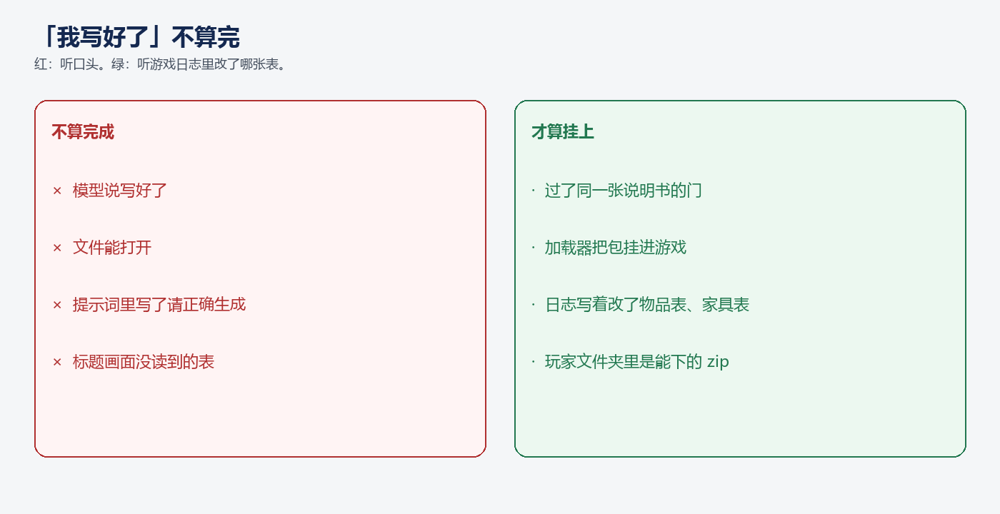
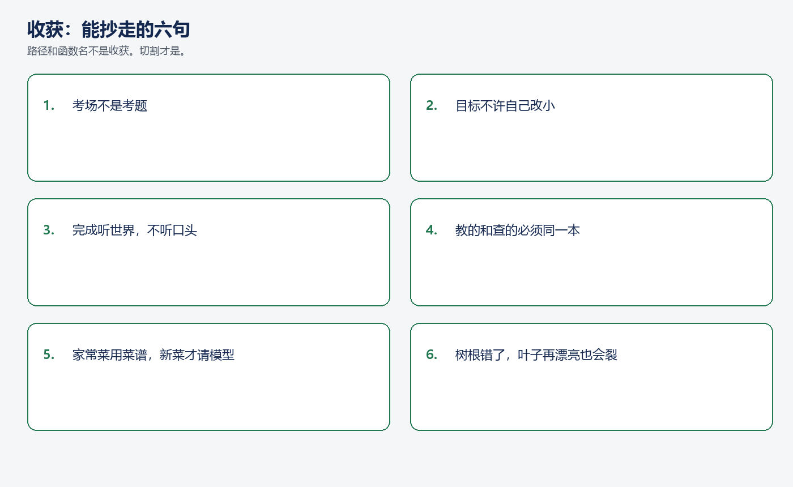

# 让 LLM 写星露谷模组，不要让模型硬写全部文件

**TL;DR**

- 别让一个大模型当万能厨师。家常菜用菜谱，新菜才请人现场做。
- 形状是游戏认的那张表长什么样，不是「文件能打开」。
- 教的和查的必须同一本说明书。过了门，才打包。
- 「我写好了」不算完。听游戏日志改了哪张表。
- 能抄走的是这套切法，不是某个仓库里的文件名。

给 Agent 加「一句话生成模组」，第一反应通常是三件事：提示词丢进一个万能模型、吐出整棵目录就打包、文件能打开就算完成。

这三条都快，也会在同一处裂开：游戏不认这些字段；半成品进了玩家文件夹；模型把「看起来合理」当成「能进游戏」。

我们没走这条。贯穿始终的一句话是：

**形状是真相，过门才打包。**

人话：先弄清游戏吃什么样的补丁；说明书和检查用同一本；过关才给包装好的包；日志里真的改了表，才叫做成了。下面按这个顺序讲。每一步先说它是什么，再说它不是什么。

---

## 第一反应是错路

别把「生成模组」焊成一次大模型调用。流水线才是灶台。模型只做菜谱上没有的那一道。

是：常见需求走写死的模板；新句子对照游戏数据写补丁；门按同一本说明书检查；过关才打包装。

不是：一个模型硬写全部文件。也不是在提示词里写「请生成正确模组」。更不是文件能打开就算完成。

厨师不能给自己打合格章。写包的人不能同时放行。

---

## 脉络：一句话出包，不要万能模型

判断按这条链往下走。上一步如果走了「不是什么」，后面再漂亮也会裂。

| 步 | 是什么 | 不是什么 |
|---|---|---|
| 需求 | 一句中文，拿到能丢进游戏的包 | 改游戏程序；万能模型吐整棵目录 |
| 接缝 | 家常菜走菜谱，新菜请人做；形状不私藏 | 一个模型既当厨师又当质检 |
| 树根 | 游戏认的数据长什么样 | 我们自己编的字段名 |
| 主干 | 说明书和检查同一本，过关才打包 | 模型写完就打包 |
| 切开 | 出包、写新菜、放行、挂上，四问分开 | 四问并成一次模型调用 |

---

## 几个词，用人话钉死

星露谷不读你随手丢进文件夹的压缩包。中间隔着两层。

**加载器**（圈内叫 SMAPI）：游戏启动时扫模组文件夹，把包挂上去，把过程写进日志。没有它，后面的补丁进不去。

**内容补丁**（圈内叫 Content Patcher）：挂在加载器上。不改游戏程序，只改数据表——物品、鱼、配方、对话。它要的包很瘦：一份「这是谁」，一份「改哪张表、改成什么样」。

所以玩家拿到的，不是「一段看起来像模组的文字」，而是游戏吃得下的补丁。日志里写着改了物品表，才叫挂上。

我们这边三个词。

**说明书**：每种表在这版游戏里长什么样。机器要带规定前缀，旁边还要有一个能放下来的家具。配方写数字编号，不写「石头」。它不是一句「请生成正确模组」，是可以拿来对答案的纸。

**模板 / 作者**：对照说明书写补丁。家常菜用模板；发光鱼、炼金机这种新句子才请模型写。

**门**（我们管它叫第一道检查）：不调模型，不看漂不漂亮，只拿说明书对这份补丁。过了才打包。过不了，半成品不进玩家手里。

后文说老师，就是说明书。说门，就是这道检查。说挂上，就是日志里出现对应的表。

---

## 整棵树

这不是一个开关。它是从游戏数据长出来的一棵树。每一层只回答一个问题。红的是「不是什么」。

- **树根**：游戏吃得下的形状，才算模组。不是文件能打开。
- **主干**：老师教形状，门卡同一本，过关才打包。不是模型写完就给玩家。
- **四根枝**：模板、作者、门、游戏日志。不是一次调用包办。
- **树叶**：已经挂上的包。可以换。不是主干。

为什么不做成「提示词进、模型出压缩包」一条直线？因为这四问不是同一个问题。混在一起，模型会既当厨师又当质检，完成标准会漂成「文件能打开」。

---

## 树根：消费者是游戏，不是我们的流水线

为什么树根必须是游戏数据，不是我们喜欢的字段名？

补丁是做给游戏吃的。游戏认编号、认官方字段、往列表里追加有固定写法。文件能打开，只证明解析器没哭，不证明湖里能钓到鱼。

是：把这版游戏每种表长什么样写进说明书，让写的人和查的人共用。

不是：在提示词里拜托模型「请正确」。形状如果只活在某次对话里，模型每次都会换一种看起来合理的字段。

菜谱要贴在墙上。不能只在点菜时口头说一句「照规矩做」。

---

## 主干：教的和查的，必须同一本

为什么不「模型写完就打包」？

模型会复述老师。老师教对的前缀，它就写对的前缀。门如果只查「有没有目标这一栏」，形状不对的包也会混过去。老师和门各说各话，换更大的模型也救不了。

是：作者对照说明书写；门对照说明书查；过关才打包。

不是：厨师给自己盖合格章。也不是口头「写好了」就算过关。

游戏不是另一套标准。加载器跑的还是树根上那张形状。日志里出现物品表、家具表，只是证明主干长进了游戏。

---

## 四根枝，四问，不能互相冒充

**模板** 问：购物、贴图、日程这种家常句子，怎么稳定出包？字段写死。能按菜谱做的，不要请人现场发挥。十份包在真机全部挂上，是这根枝的叶子。

**作者** 问：菜谱上没有的新句子怎么写？发光鱼、炼金机、风暴遗物。只写数据补丁，对照树根，过门才打包。不是第二个万能厨师，也不改游戏程序。

**门** 问：这份补丁能不能打包？不调模型。写的人不能同时放行。

**日志** 问：挂上了没有？标题画面没读到的表，等于没测。完成听日志，不听自评。

四问并成一次模型调用，门会变软，模板会肿成万能作者，日志会被「文件能打开」代替。拆开，是为了每一问都有一个不能被替换的答案。

---

## 树叶只证明主干长进了游戏

叶子会换。树根和主干对了，换一条提示词还是同一棵树。叶子不是产品目录，是证据。

发光鱼：物品表多一条鲤，山湖刷新是追加不是覆盖。日志出现物品表和地点表。

炼金机：十块石头进、一块金矿石出。能放下来的家具，加上带前缀的机器规则。日志出现家具表和配方表。

唤雷遗物：可合成、暴风雨那天加增益、法师多一句台词。内容补丁劈不出真闪电，暴风雨加增益是它能做的那一档。

三份过门，三份挂上。发光还在借用原版图案。叶子不必完美，主干必须绿。

「我写好了」不算完。听日志。

---

## 收获和结论

叶子会改名，函数会搬家。能抄走的是下面六句。

**收获**

1. **别让模型硬写全部文件。** 家常菜用菜谱；新菜才请人做。不是一次调用包办。
2. **形状是游戏认的，不是我们编的。** 消费者是游戏。不是「字段看起来合理」。
3. **教的和查的必须同一本说明书。** 教什么就卡什么，过关才打包。不是各说各话。
4. **写包的人不能同时放行。** 门不调模型。不是自己给自己打勾。
5. **「我写好了」不算完。** 听日志里改了哪张表。不是文件能打开就算完成。
6. **树根错了，叶子再漂亮也会在同一处裂开。** 万能模型、提示词当说明书、能打开就算完——进游戏会对不上。

**结论**

给 Agent 加「一句话生成模组」，不是让它「记得写出正确文件」，而是让世界有一本游戏认的说明书，并且每一次打包都重新过同一道门。能抄走的是这套切法，不是某个仓库里的文件名。

**PS.** 只带走一句的话：形状是真相，过门才打包。说明书和检查用同一本；日志里改了表，才叫做成了。

**PPS.** 这和「把模型训得更听话」不是一回事。提示词只能说该写什么；门才决定能不能打包。更大的模型代替不了同一本说明书。

**PPPS.** 文里的阶段名会过时。如果你在自己的系统里让模型硬写全部文件、用提示词当说明书、用「能打开」当完成——出包、放行、进游戏，会在同一处裂开。那才是这篇要拦的事。

想对照源码：GitHub `yhyu13/AgentMODGenerator`。
