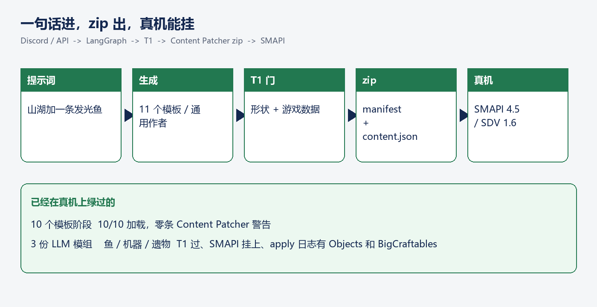
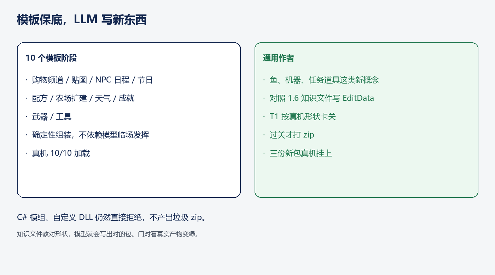
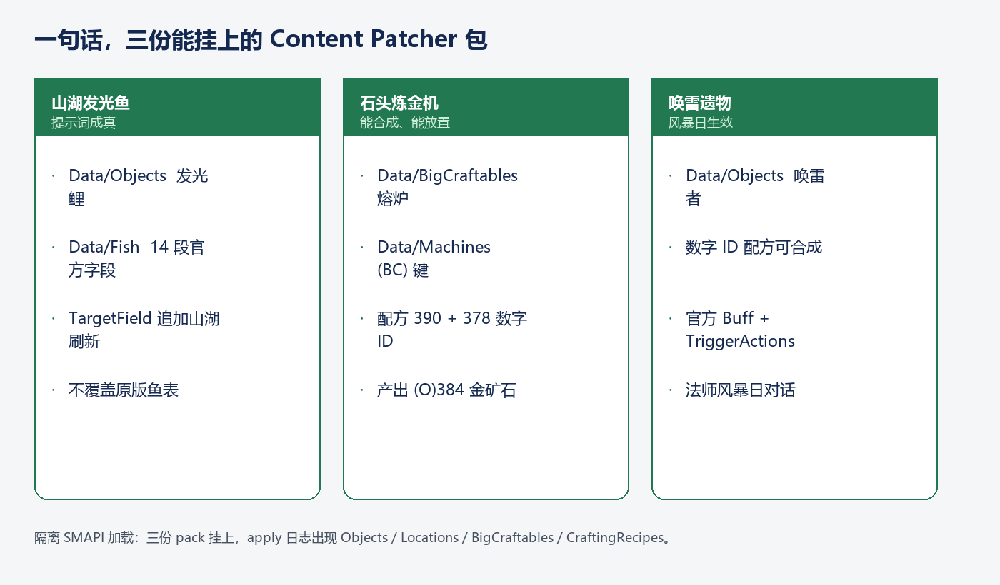

# 一句话进，zip 出：让 LLM 写出能挂进星露谷的模组

发一句「在山湖加一条会发光的鱼」，过一会儿拿到一个 zip，丢进 `Mods/`，SMAPI 把它挂上。这就是这个项目现在能做的事。

不是演示用的假文件。是标准 Content Patcher 包：`manifest.json` + `content.json`，对着星露谷 1.6.15、SMAPI 4.5.2、Content Patcher 2.9.1 真机加载过。Discord 能下单，HTTP API 也能下单。

---

## 从一句话到能进游戏的 zip

入口有两条。Discord 里 `/generate`，把提示词丢进去；或者 `POST /v1/mods/generate`，马上拿到 `request_id`。后面是一条 LangGraph：路由 → 生成 → T1 门 → 打包。状态缓存在 Redis，zip 进 S3（本地开发直接落盘）。调用方轮询 `GET /v1/mods/status/{id}`，完成了用预签名链接把包拉下来。

T1 是确定性的。不调模型，只看这份 `content.json` 像不像星露谷 1.6 吃得下的补丁：资产在不在、机器键带不带 `(BC)`、配方是不是数字 ID、往地点追加鱼刷新有没有用 `TargetField`。过了才打 zip。过不了，不会把半成品塞给玩家。

生成器也不是一个万能模型硬写全部文件。常见需求走模板，新概念才交给 LLM。C# 模组、自定义 DLL、要改游戏程序的句子，路由会直接拒绝——宁可不给包，也不给一份进游戏就炸的 zip。

---

## 十个模板，真机 10/10

购物频道、作物贴图、NPC 日程、节日事件、配方、农场扩建、天气、成就、武器、工具。这十类有固定组装器，字段和文件布局是写死的，不靠模型临场发挥。

同一套脚本重生十份 demo，装进游戏，标题画面 **10/10 加载，零条 Content Patcher 警告**。贴图替换能生效，工具和武器能进数据表，天气走官方 Buff 和触发器，节日和日程按 Content Patcher 的 `When` 过滤。这是流水线的地板：常见需求，稳定出包，稳定能挂。

---

## 新句子交给通用作者

模板覆盖不了的话——「加一条会发光的鱼」「做一台把石头炼成金矿的机器」「做一件风暴里会响的遗物」——走通用作者。一个 LLM，对照 1.6 的数据词汇写 `EditData`。知识文件里是真机形状：鱼 14 段官方字段、地点用 `TargetField` 追加刷新、机器必须 `BigCraftables` 配 `(BC)` 键的 `Machines`、天气走 `TriggerActions` + `AddBuff`、配方用 `390` 这种 ID 而不是 `Stone`。

过 T1 才打 zip。门和老师用同一套形状，模型写出来的包才能进游戏。

---

## 三句话，三份已经挂上的包

我们拿三条真人会说的提示词，过了一遍通用作者，装进 `Mods/`，关掉其它 demo，只留 Content Patcher 和这三份，开了一次真机。

**山湖发光鱼。** 对象表里多一条发光鲤；鱼数据按 wiki 写满 14 段；山湖刷新用 `TargetField: ["Mountain", "Fish"]` 追加，不覆盖原版鱼。SMAPI 日志里出现 `Data/Objects` 和 `Data/Locations`。

**石头炼金机。** 十块石头进、一块金矿石出。可放置物写在 `Data/BigCraftables`，机器规则键是 `(BC)stone_smelter`，配方 `390 50 378 20/.../true`。日志里出现 `Data/BigCraftables` 和 `Data/CraftingRecipes`。

**唤雷遗物。** 可合成的遗物、官方 1.6 Buff、风暴日 `DayStarted` 触发 `AddBuff`、法师在暴风雨里多一句台词。Content Patcher 劈不出真闪电，风暴日加 Buff 是它能做的那一档。

三份 T1 全绿，三份 pack 挂上，没有 preload error。知识文件和 T1 对齐过一次官方格式之后，模型写的就是这对形状。

---

## 你能直接拿走的

1. **常见需求用模板，新概念才交给模型。** 十个阶段保底加载；鱼、机器这类句子走通用作者。
2. **教模型真游戏数据。** 机器要成对，配方要数字 ID，往列表追加用 `TargetField`。
3. **门要能在真机产物上变绿。** T1 过了才打 zip；SMAPI 日志里出现对应资产，才算挂上。

项目在 GitHub：`yhyu13/AgentMODGenerator`。本地 `make test`，再 `uvicorn` 起 API，就可以自己打一句提示词试试。
