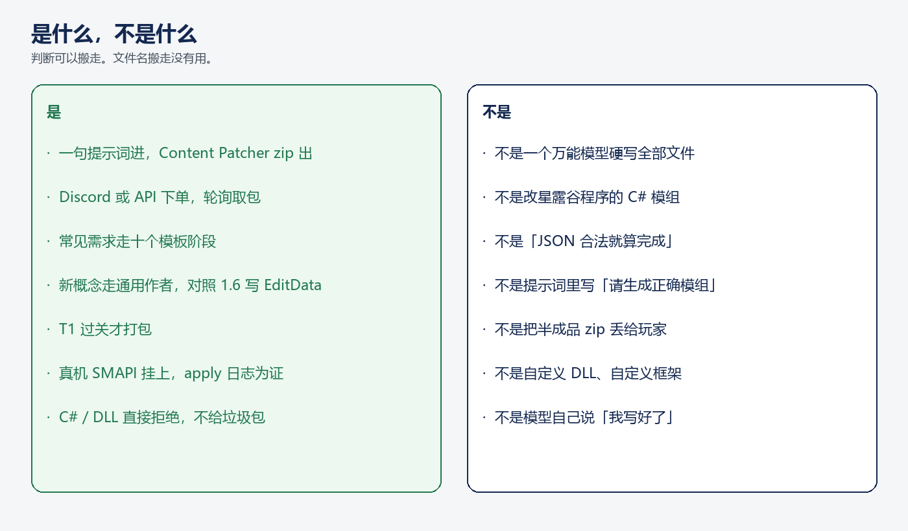

# 让 LLM 写星露谷模组，不要让模型硬写全部文件

给 Agent 加「一句话生成模组」，第一反应通常是：把提示词丢进一个大模型，让它吐出整棵目录，再指望 zip 能进游戏。

我们没这么做。生成器不是万能作者。常见需求走模板，新句子才交给 LLM。贯穿始终的一句话是：

**形状是真相，过门才打包。**

读完带走两样：我们现在能一句话出能进游戏的 zip；以及做成这件事靠的不是更大的模型，而是「模板保底、说明书和检查同一套、以 SMAPI 日志为完成」。中间用树根、主干、分支把设计讲清楚。先把后文要用的词钉死。

---

## 先把词落地

星露谷本体不读你丢进文件夹里的随便一个 zip。中间隔着两层运行时。

**SMAPI**（Stardew Modding API）是模组加载器。游戏启动时由它扫描 `Mods/`，把每个模组挂上去，并把加载过程写进日志。没有 SMAPI，Content Patcher 包进不去。

**Content Patcher** 是挂在 SMAPI 上的一个模组。它不改游戏程序，只补丁数据表：物品、鱼、配方、对话。它认的包很瘦：一份 `manifest.json`（这是谁、依赖谁）加上一份 `content.json`（要改哪张表、改成什么样）。`content.json` 里每一段补丁叫一次 `EditData`，`Target` 写资产名，比如 `Data/Objects`。

所以玩家拿到的 zip，不是「一段看起来像模组的文本」，而是 **Content Patcher 吃得下的补丁**。SMAPI 日志里出现 `edited Data/Objects`，才叫挂上。

生成器这一侧对应三个词。

**`data_schemas.json`** 是老师。一份写死的知识文件，告诉作者：每种 `Data/` 资产在 1.6 里长什么样、哪些字段是整数、往列表追加该用什么。它不是提示词里一句「请生成正确模组」，而是可检查的形状。机器那一条长这样：

```json
"Data/Machines": {
  "note": "Every Entries key MUST start with (BC). Pair with Data/BigCraftables.",
  "example": { "(BC)stone_smelter": { "OutputRules": [...] } }
}
```

配方那一条写明：原料是 `390`（石头）、`378`（铜矿石），不是 `Stone`、`CopperOre`。

**模板 / 通用作者** 对照这份文件写出 `content.json`。常见需求走模板组装器；鱼、机器、遗物这类新句子走 LLM。

**T1** 是第一道确定性门。不调模型，不看「写得漂不漂亮」，只拿老师的形状核对这份 JSON：机器键带不带 `(BC)`、配方是不是数字 ID、有没有发明游戏没有的资产。过了才打 zip。过不了，半成品不进玩家手里。


后文说「老师」，指 `data_schemas.json`。说「门」，指 T1。说「挂上」，指 SMAPI 日志里出现对应资产。

---

## 先看整棵树

这件事不是一个功能开关，而是从游戏数据长出来的一棵树：

- **树根**：星露谷 1.6 吃得下的补丁形状，才算模组
- **主干**：老师教形状，T1 卡同一套，过关才打 zip
- **四根分支**：模板、通用作者、T1 门、真机证据
- **树叶**：十份模板 demo，三份已经挂上的 LLM 包


为什么切成树，而不是一条「提示词 → 模型 → zip」的直线？因为这四件事回答的问题不一样。混在一起，模型会既当老师又当门，完成标准会漂成「JSON 能解析」。树根钉死形状；主干保证老师和门同一套；分支各管一问；树叶只是证据，可以换。

---

## 是什么，不是什么

这是一句提示词进、一份 Content Patcher zip 出的流水线。Discord 或 HTTP API 下单，轮询取包，丢进 `Mods/`，对着星露谷 1.6.15、SMAPI 4.5.2、Content Patcher 2.9.1 真机加载过。

这不是一个万能模型硬写全部文件，也不是改游戏程序的 C# 模组。自定义 DLL 在路由就被拒绝。完成不靠模型说「我写好了」——靠门变绿，靠 SMAPI 日志。



提示词只引导「该写什么」。T1 才决定「能不能打包」。

---

## 树根：游戏吃得下的形状，才是模组

为什么必须有树根，而且树根必须是游戏数据，不是「生成器自己的 JSON 风格」？

因为 Content Patcher 补丁的消费者是游戏，不是我们的流水线。游戏认限定 ID、官方字段、往列表追加用 `TargetField`。JSON 合法只证明解析器没哭，不证明湖里能钓到鱼。

树根不是「生成一段看起来像模组的文本」。树根是 1.6 的数据形状，写进 `data_schemas.json`。鱼 14 段官方字段、地点用 `TargetField` 追加、机器必须大工艺品配 `(BC)` 键、天气走触发器加 Buff、配方用数字 ID。

形状不写进老师、只写在提示词里，模型每次都会换一种「看起来合理」的字段。树根存在的理由：让形状成为唯一真相，而不是某次对话里的临场发挥。

---

## 主干：老师教形状，门卡同一套

为什么主干是「过 T1 才打 zip」，而不是「模型写完就打包」？

LLM 会复述老师。老师教 `(BC)`，它就写 `(BC)`。门如果只查「有没有 `Target`」，老师教对了也会被一份形状不对的包混过去；老师和门各说各话，换更大的模型也救不了。

所以主干做一件事：老师和门共用 `data_schemas.json` 里那一套。作者（模板或 LLM）对照它写；T1 对照它查；过关才打 zip。


真机不是另一套标准。SMAPI 跑的还是树根上的形状。日志里出现 `Data/Objects`、`Data/BigCraftables`，只是证明主干长到了游戏里。

---

## 分支为什么要拆开

四根枝必须正交，因为每一根回答的问题换了就不能用另一根冒充。

**模板** 回答：购物频道、贴图、日程这类常见句子，怎么确定性出包？字段写死，不靠模型临场发挥。能装配的就不要交给 LLM——这不是「模型写不好才用的退路」，是主干在常见需求上的短路。十份 demo 真机 **10/10 加载**，是这根枝的叶子。

**通用作者** 回答：模板没有的新句子怎么写？山湖发光鱼、石头炼金机、风暴遗物。它只写 Content Patcher 补丁，对照树根，过 T1 才打包。它不是第二个万能生成器，也不写 C#。

**T1 门** 回答：这份 JSON 能不能打 zip？不调模型。不能让「写包的」同时当「放行的」。

**真机证据** 回答：挂上了没有？标题画面没请求的资产，等于没测。完成标准必须落在 SMAPI 日志上，不能落在模型自评上。

把这四问并成一根枝，门会变软，模板会膨胀成万能作者，真机会被「JSON 能解析」代替。拆开，是为了每一问都有一个不能被别的问替换的答案。

---

## 树叶：三句话，三份能挂上的包

叶子会换。树根和主干对了，换一条提示词还是同一棵树。树叶存在的理由只有一个：证明主干已经长进游戏，不是只在仓库里自洽。


**发光鱼。** 对象表多一条鲤；鱼数据 14 段；山湖刷新 `TargetField` 追加。日志出现 `Data/Objects`、`Data/Locations`。

**炼金机。** 十块石头进、一块金矿石出。可放置物在大工艺品表，机器键 `(BC)stone_smelter`，配方 `390 50 378 20`。日志出现 `Data/BigCraftables`、`Data/CraftingRecipes`。

**唤雷遗物。** 可合成遗物、官方 Buff、风暴日加 Buff、法师多一句台词。Content Patcher 劈不出真闪电，风暴日加 Buff 是它能做的那一档。

三份 T1 全绿，三份 pack 挂上。发光仍复用原版精灵。叶子不必完美，主干必须绿。

---

## 我们得到了什么

一句话：玩家发一句中文，可以拿到一份能丢进 `Mods/`、被 SMAPI 挂上的 Content Patcher 包。

具体三样已经在真机上跑过：

- 十个常见需求（购物、贴图、日程、节日、配方、农场、天气、成就、武器、工具）整包加载，没有 Content Patcher 警告。
- 三条新句子（发光鱼、炼金机、唤雷遗物）过了 T1，日志里出现了对应的数据表。
- 要写 C#、要自定义 DLL 的需求，系统会直接拒绝，不会塞一份进游戏就炸的 zip。

Discord 和 HTTP API 都能下单。不是演示幻灯片，是能下载的 zip。

---

## 结论

做「LLM 写游戏模组」，成功不长在模型更大，长在三件事对齐：

**第一，别让模型硬写全部文件。** 能写死的用模板；只有模板没有的新概念才交给 LLM。

**第二，教模型和检查模型必须用同一张说明书。** 说明书就是游戏真正认的数据形状（`data_schemas.json`）。T1 按它放行，过了才打包。模型自己说「写好了」不算。

**第三，完成标准是游戏挂上了，不是 JSON 能解析。** SMAPI 日志里出现 `Data/Objects`、`Data/BigCraftables`，才叫做成了。

换一条鱼、换一个机器，叶子会变。这三句不变，还是同一套系统。缺任何一句，看起来能出包，进游戏会对不上。

项目在 GitHub：`yhyu13/AgentMODGenerator`。本地 `make test`，再起 API，就可以自己打一句提示词试试。
