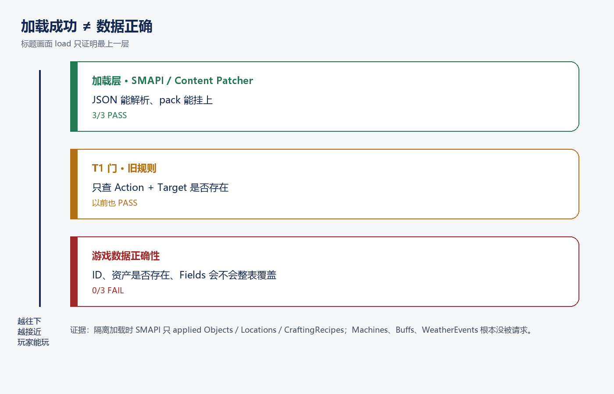
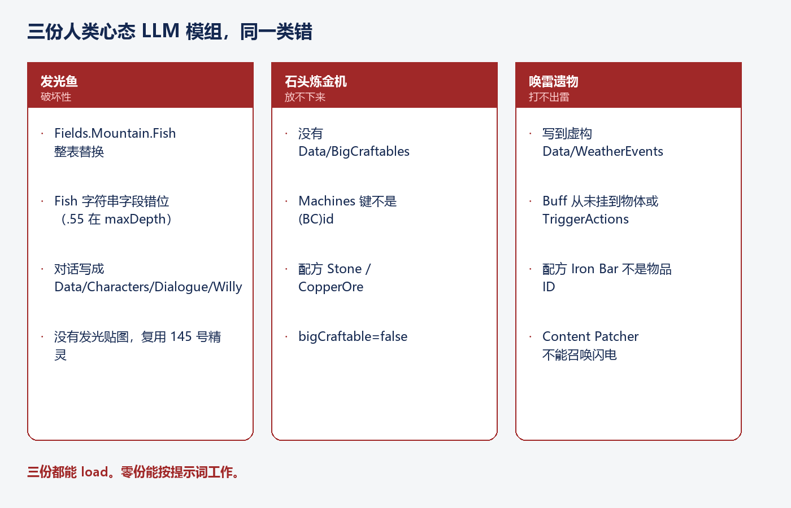
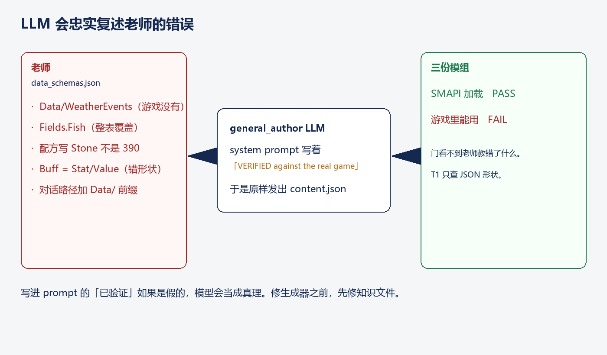
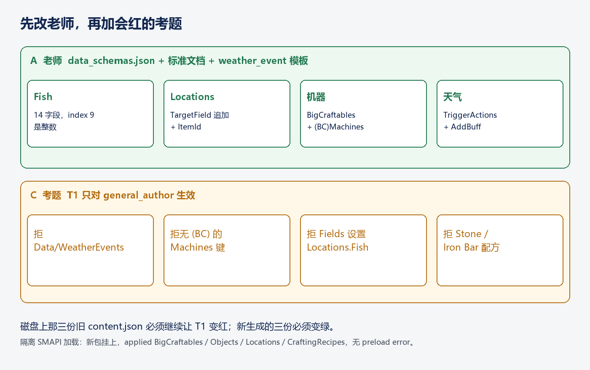

# 让 LLM 写星露谷模组：加载成功，不等于玩家能玩

给 Agent 一条提示词「在山湖加一条会发光的鱼」，它交回一个 zip，SMAPI 绿灯。你以为做完了。

把 zip 丢进 `Mods/`，进标题画面，Content Patcher 也确实改了 `Data/Objects`。然后你去钓鱼——山湖里原来的鱼全没了，新鱼也可能根本钓不上来。

问题不在模型「不够聪明」。问题在：你把「JSON 能解析」当成了「游戏数据正确」。这两层差了一整个运行时。

---

## 先把三层拆开

**Content Patcher** 是星露谷模组的主流写法：不改游戏程序，只补丁数据资产（`Data/Objects`、`Data/Fish`、配方、对话）。它接受一份 `content.json`，里面是一串 `EditData`。只要 JSON 合法、目标资产名能解析，pack 就能挂上。

**T1** 是我们流水线里的第一道确定性门：不调模型，只扫文件形状。旧规则几乎只问：`Action` 和 `Target` 在不在。在，就过。

**游戏数据正确** 是另一件事。物品 ID 是不是数字或限定名、资产在 1.6 里是否存在、`Fields` 会不会把整张表盖掉——这些 SMAPI 标题画面不一定会碰到。没被请求的资产，不会出现在 apply 日志里，也就不会报错。

我们在真机上隔离加载了三份「人类心态」LLM 模组（关掉 Demo pack，只留 Content Patcher 和这三份）。结果干净得吓人：3/3 加载，0 条 preload error。同时，`Data/Machines`、`Data/Buffs`、`Data/WeatherEvents` 根本没被请求。加载成功只证明了最上一层。

---

## 三份模组，同一类错

提示词分别是：山湖发光鱼、石头炼成金矿的机器、召唤闪电的任务道具。模型都写了看起来像那么回事的 `content.json`。对照官方 1.6 数据格式，三份都不能按提示词工作。

发光鱼最危险。Content Patcher 的 `Fields` **替换**已有属性，不是追加。`Fields.Mountain.Fish = [新条目]` 会抹掉山湖全部原版鱼（包括传奇）。正确追加要用 `TargetField: ["Mountain", "Fish"]` 加上带 `ItemId` 的 `Entries`。模型还把鱼的管道字符串写错位：wiki 规定第 9 段是整数最大水深，它把 `.55`（概率）塞进去，尾巴再挂一串诱饵字段。

炼金机缺了一半。1.6 的机器必须成对：`Data/BigCraftables` 里一个可放置物，`Data/Machines` 里一条规则，键必须是 `(BC)石头熔炉id`。这份只写了机器规则，键还是裸 `stone_smelter`。配方写成 `Stone 50 CopperOre 20`——游戏要的是 `390` 和 `378`。第四段 `false` 表示产出普通物品，不是大工艺品。结果：合成不了，也放不下来。

唤雷遗物写进了 **`Data/WeatherEvents`**。星露谷 1.6 没有这个文件，没有 `WeatherEvents.xnb`。闪电也不是 Content Patcher 能召唤的；要事件脚本、`Data/TriggerActions`，或 C#。Buff 用了错误字段名，物体 `Edibility: -300` 且没有挂 Buff，吃了也不会生效。配方还是 `Iron Bar` 这种显示名。

三份都能 load。零份能按提示词工作。

---

## 模型在复述老师

这些错不是随机幻觉。它们和仓库里那份自称「已对照真机验证」的 `data_schemas.json` 对得上：虚构的天气事件资产、错的 Buff 形状、错位的 Fish 示例、教人用 `Fields` 改 `Fish`。天气事件模板和标准文档也在教同一套假形状。通用作者的 system prompt 还点名了一个不存在的 `Data/BuffData`。

LLM 很听话。你把错的格式标成 VERIFIED，它就当真理。门如果只检查「有没有 `Target`」，老师教错的东西会整包过关。

这和「模型不够强」不是一类问题。换更大的模型，只要老师文件还在，还会写出 `Data/WeatherEvents`。

---

## 先改老师，再加会红的考题

流水线不用重写。改三处就够。

老师：删掉虚构资产；Fish 按 wiki 写满 14 段，第 9 段必须是整数；地点用 `TargetField` 追加；机器必须成对且键带 `(BC)`；配方用数字 ID；对话路径不要加 `Data/`；天气改走 `Data/TriggerActions`（`DayStarted` + `WEATHER Here Storm` + `AddBuff`）。

考题：T1 对通用作者拒绝上述五类形状。夹具就是磁盘上那三份旧 `content.json`——它们必须继续让 T1 变红。新生成的三份必须变绿。先写红测，再改实现。

改完之后用活模型重跑那三条提示词。鱼：对象 + 14 段 Fish + `TargetField` 追加。机器：BigCraftables + `(BC)stone_smelter` + `390 50 378 20/.../true`。遗物：物体 + 数字配方 + 官方 Buff + 风暴日 `AddBuff` + 法师对话。隔离 SMAPI 加载再次全绿，这次 apply 日志里出现了 `Data/BigCraftables`。

还没做完的，要说清楚。发光仍是复用原版 145 号精灵，没有自定义贴图。闪电仍是近似：风暴日加 Buff，使用道具不会劈下一道雷。标题画面也不会去请求 `Data/Fish` / `Data/Machines` / `Data/TriggerActions`——那些要进存档才会碰到。加载绿了，不代表湖里已经能钓到鱼、熔炉已经能炼金。

---

## 能搬走的判断

四句话，不绑这个仓库：

1. **加载成功不是正确性。** 标题画面没请求的资产，等于没测。
2. **模型会复述老师。** 标成 verified 的知识文件如果是假的，生成器会稳定地错。
3. **`Fields` 会整表覆盖。** 往列表追加必须用 `TargetField` + `Entries`。
4. **门要能对着真实失败变红。** 夹具用已经错过的产物，不要用想象出来的 JSON。

目标功能那套说法在这里也适用：完成必须拿工作区当权威，不能靠模型自己说「我写好了」。SMAPI 日志、官方数据格式、磁盘上的 `content.json`，才是证据。模型的「T1 过了」不是证据。
