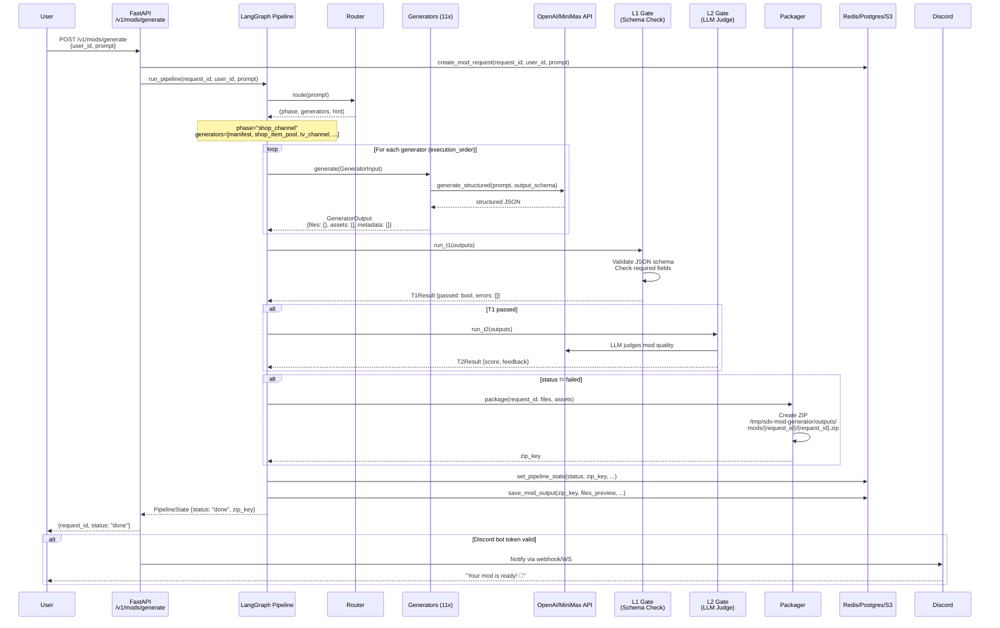

# SDV Mod Generator — Interaction Flow

## Overview

User sends a prompt (e.g., "做一个电视购物频道") → AI generates a complete Content Patcher mod zip → delivered back to user.

---

## Sequence Diagram



---

## Pipeline Graph (LangGraph State Machine)

```mermaid
stateDiagram-v2
    [*] --> Route: POST /v1/mods/generate

    state Route {
        [*] --> detect_game: prompt
        detect_game --> route: keyword match
        route --> (phase, generators, hint)
    }

    Route --> Generate: game, phase, generators

    state Generate {
        [*] --> gen_1: manifest_generator
        gen_1 --> gen_2: shop_item_pool_generator
        gen_2 --> gen_3: tv_channel_generator
        gen_3 --> gen_4: mail_system_generator
        gen_4 --> gen_5: item_sprites_generator
        gen_5 --> gen_6: ui_assets_generator
        gen_6 --> gen_7: catalog_preview_generator
        gen_7 --> gen_8: realism_damage_generator
        gen_8 --> gen_9: trigger_logic_generator
        gen_9 --> gen_10: config_schema_generator
        gen_10 --> gen_11: content_json_generator
        gen_11 --> [*]: GeneratorOutput[]
    }

    Generate --> T1_Gate: outputs

    state T1_Gate {
        [*] --> validate_files: Check JSON/TSV validity
        validate_files --> check_manifest: manifest.json required fields
        check_manifest --> check_shops: assets/data/shops.tsv structure
        check_shops --> check_mail: any mail/* file exists
        check_mail --> check_content: content.json is array of actions
        check_content --> [*]: passed=True
    }

    T1_Gate --> T2_Gate: passed=True
    T1_Gate --> [*]: passed=False → failed

    state T2_Gate {
        [*] --> llm_judge: LLM reviews mod quality
        llm_judge --> [*]: score, feedback<br/>(advisory only)
    }

    T2_Gate --> Package: passed or not

    state Package {
        [*] --> assemble: Collect all files + assets
        assemble --> zip: Write ZIP to<br/>/tmp/sdv-mod-generator/outputs/<br/>mods/{request_id}/{request_id}.zip
        zip --> [*]: zip_key
    }

    Package --> [*]: status="done"
```



---

## Generator Architecture

```mermaid
graph TD
    subgraph StardewValleyPack
        subgraph shop_channel phase
            G1[ManifestGenerator]
            G2[ShopItemPoolGenerator]
            G3[TVChannelGenerator]
            G4[MailSystemGenerator]
            G5[ItemSpritesGenerator]
            G6[UIAssetsGenerator]
            G7[CatalogPreviewGenerator]
            G8[RealismDamageGenerator]
            G9[TriggerLogicGenerator]
            G10[ConfigSchemaGenerator]
            G11[ContentJsonGenerator]
        end

        subgraph texture phase
            G12[TextureGenerator]
        end
    end

    subgraph Base Classes
        Base[BaseGenerator<br/>generate() + validate_output()]
        Input[GeneratorInput<br/>{prompt, hint, prior_outputs}]
        Output[GeneratorOutput<br/>{files, assets, metadata}]
    end

    G1 --> Base
    G2 --> Base
    G3 --> Base
    G4 --> Base
    G5 --> Base
    G6 --> Base
    G7 --> Base
    G8 --> Base
    G9 --> Base
    G10 --> Base
    G11 --> Base
    G12 --> Base

    style G11 fill:#f9f,stroke:#333,stroke-width:2px
    style G1 fill:#bbf,stroke:#333,stroke-width:2px
```

---

## File Output Structure

```
mods/{request_id}/
└── {request_id}.zip
    ├── manifest.json           # Content Patcher manifest
    ├── content.json           # Content Patcher changes array
    ├── config.json            # Mod configuration
    ├── assets/
    │   ├── data/
    │   │   ├── shops.tsv              # Shop item pool
    │   │   ├── tv_channels.json       # TV channel definition
    │   │   ├── catalog_preview.json   # Item catalog
    │   │   └── damage_modifiers.json # Balance settings
    │   ├── sprites/
    │   │   ├── shop_sprites.png       # PNG sprite
    │   │   └── shop_logo.json         # Sprite metadata
    │   └── ui/
    │       ├── catalog_background.png  # PNG tile
    │       └── catalog_background.json # UI metadata
    ├── mail/
    │   ├── broadcast_*.json    # TV-triggered mail
    │   └── purchase_*.json    # Item delivery mail
    └── data/
        └── trigger_actions.json # Shop open/purchase triggers
```

---

## API Endpoints

```mermaid
graph LR
    A[User] -->|POST /v1/mods/generate| B[FastAPI]
    B -->|run_pipeline| C[LangGraph]
    C -->|Route| D[Router]
    C -->|Generate| E[Generators]
    C -->|T1 Gate| F[gate_t1]
    C -->|T2 Gate| G[gate_t2]
    C -->|Package| H[Packager]
    H -->|ZIP| I[/tmp/outputs/...]

    J[User] -->|GET /v1/mods/{id}| B
    B -->|query| K[(Redis<br/>Postgres)]

    style B fill:#dfd,stroke:#333
    style C fill:#ffd,stroke:#333
    style D fill:#fdd,stroke:#333
    style E fill:#dff,stroke:#333
```

| Endpoint | Method | Description |
|---|---|---|
| `/health` | GET | Health check |
| `/v1/mods/generate` | POST | Trigger mod generation |
| `/v1/mods/{request_id}` | GET | Query generation status |
| `/webhooks/discord` | POST | Discord interaction webhook |

---

## Technology Stack

| Layer | Technology |
|---|---|
| API | FastAPI + Uvicorn |
| Orchestration | LangGraph (StateGraph) |
| LLM | OpenAI SDK / Anthropic (MiniMax-compatible) |
| Database | PostgreSQL (asyncpg) |
| Cache | Redis |
| Storage | S3 / Local filesystem |
| Discord | discord.py |
| Proxy | SOCKS5 (aiohttp_socks) |

---

## Configuration

Environment variables (from `config/.env`):

| Variable | Purpose |
|---|---|
| `OPENAI_API_KEY` | MiniMax/OpenAI API key |
| `OPENAI_BASE_URL` | API endpoint |
| `OPENAI_MODEL` | Model name |
| `DATABASE_URL` | PostgreSQL connection |
| `REDIS_URL` | Redis connection |
| `DISCORD_BOT_TOKEN` | Discord bot authentication |
| `ALL_PROXY` | SOCKS5 proxy for LLM calls |
